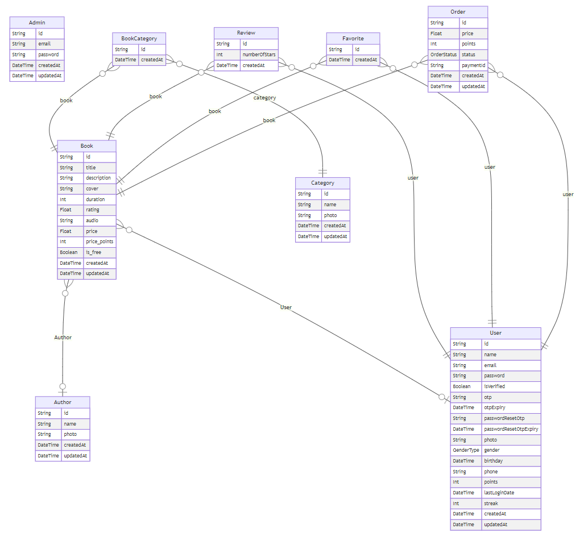

# Sard Backend API

Backend API service for Sard Application and Admin Dashboard, built with NestJS, TypeScript, and Prisma.

## Features

- **User Authentication**: JWT-based authentication with email verification
- **Role-Based Access Control**: Admin and user roles with protected endpoints
- **Audiobook Management**: CRUD operations for books with audio/file storage
- **E-commerce Integration**: Payment processing with PayMob
- **AI Features**: Book summarization and description generation using Groq
- **Content Management**: Authors, categories, and favorites system
- **Points & Streaks System**: User engagement tracking with rewards
- **File Storage**: Cloudinary for images, Google Drive for audio files
- **Email Service**: Nodemailer integration with Pug templates

## Technologies

- **Framework**: NestJS
- **Database**: MongoDB with Prisma ORM
- **Authentication**: JWT, Passport
- **File Storage**: Cloudinary (images), Google Drive (audio)
- **AI Integration**: Groq API
- **Payment Processing**: PayMob
- **Email Service**: Nodemailer
- **Validation**: Class-validator, Joi

## Installation

1. Clone the repository:

```bash
git clone https://github.com/sard-org/sard_api.git
cd sard_api
```

2. Install dependencies:

```bash
npm install
```

3. Set up environment variables (create `.env` file):

```env
DATABASE_URL="mongodb://..."

JWT_SECRET="your_jwt_secret"

CLOUDINARY_CLOUD_NAME="..."
CLOUDINARY_API_KEY="..."
CLOUDINARY_API_SECRET="..."

GOOGLE_DRIVE_CLIENT_EMAIL="..."
GOOGLE_DRIVE_PRIVATE_KEY="..."
GOOGLE_DRIVE_FOLDER_ID="..."

PAYMOB_API_KEY="..."
PAYMOB_INTEGRATION_ID="..."
PAYMOB_IFRAME_ID="..."

GROQ_API_KEY="..."

EMAIL_HOST="..."
EMAIL_PORT=587
EMAIL_USER="..."
EMAIL_PASSWORD="..."
EMAIL_FROM="..."
```

4. Run database migrations:

```bash
npx prisma generate
npx prisma db push
```

## Running the App

**Development mode:**

```bash
npm run start:dev
```

**Production mode:**

```bash
npm run build
npm run start:prod
```

**Other commands:**

```bash

# Lint code
npm run lint

# Format code
npm run format
```

## Database Schema



## Environment Variables

| Variable Name   | Description                        |
| --------------- | ---------------------------------- |
| DATABASE_URL    | MongoDB connection string          |
| JWT_SECRET      | JWT signing key                    |
| CLOUDINARY\_\*  | Cloudinary configuration           |
| GOOGLE*DRIVE*\* | Google Drive API credentials       |
| PAYMOB\_\*      | PayMob payment gateway credentials |
| GROQ_API_KEY    | Groq AI API key                    |
| EMAIL\_\*       | SMTP email server configuration    |

## License

UNLICENSED

---

**Contact**: [Mohamed Ramadan] - MohamedRamadanSaudi@gmail.com
